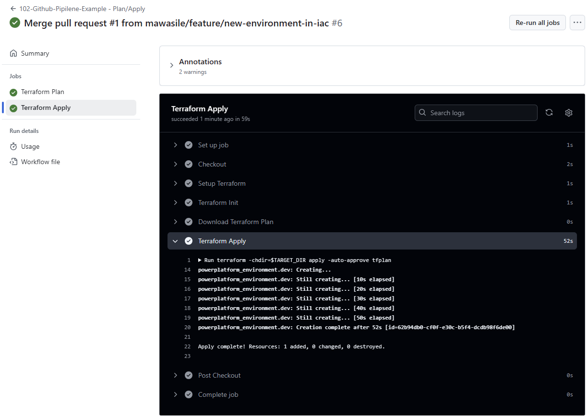

<!-- This document is auto-generated. Do not edit directly. Make changes to README.md.tmpl instead. -->
# GitHub Pipeline Example (102 level)

This example demonstrates how to create a pipeline that will deploy a Power Platform environment using Terraform.

## Prerequisites

- Entra ID Tenant
- Azure subscription where the Terraform state will be stored
- Power Platform environment
- Already executed [bootstrap](../../bootstrap/README.md) script
- Configured federation between the GitHub repository that you use for this pipeline and the Entra ID tenant: <https://docs.github.com/actions/deployment/security-hardening-your-deployments/configuring-openid-connect-in-azure>

## Example Files

The example files can be found in `quickstarts/102-github-pipeline`

## Provider Requirements

The Terraform plugins or "providers" that this IaC deployment requires are:

- **powerplatform (`microsoft/power-platform`):** (any version)

## Resources

- `powerplatform_environment.dev` from `powerplatform`

## Usage

You can fork or download this repository and use it as a starting point for your own pipeline. Copy the [tf-102-example-pipeline.yml](./tf-102-example-pipeline.yml) to the `.github/workflows` directory in your repository.

You will have to set the following [secrets in your repository](https://docs.github.com/en/actions/writing-workflows/choosing-what-your-workflow-does/store-information-in-variables#creating-configuration-variables-for-a-repository):

- PPADMIN_CLIENT_ID = `<your tenant id>`
- PPADMIN_TENANT_ID = `<bootstrapped service principal tenantId>`
- TF_STATE_STORAGE_ACCOUNT_NAME = `<your storage account name, created by bootstrap.sh>`
- TF_STATE_RESOURCE_GROUP_NAME  = `<your resource group name, created by bootstrap.sh>`

To run the pipeline, you will have to create a new branch based on your main branch, push it, and create a pull request. The pipeline will run the `Terraform Plan` step on every push to the repository.
The pipeline will authenticate using OpenID Connect and will require setting federation between the GitHub repository and the Entra ID tenant. With federation configured, no additional credentials are required to execute pipeline steps against Azure or Power Platform.

The Terraform Plan output will also be added to your pull request as a comment:

## Detailed Behavior

The pipeline example was created to demonstrate how to deploy Power Platform environment using Terraform. The pipeline is created from two steps

- `Terraform Plan`: is responsible for creating a plan of the changes that will be applied to the infrastructure. The plan is stored as an artifact and can be reviewed before applying the changes. This step will run on every push to the repository.

- `Terraform Apply`: is responsible for applying the changes to the infrastructure. The changes are applied only if the plan was reviewed and approved. This step will run on every push `main` branch.

## Limitations and Considerations

- This module is provided as a sample only and is not intended for production use without further customization.
